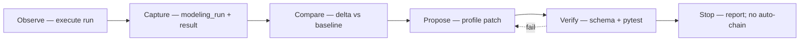

# Modeling Base — Institutional Scenario Registry

**Epistemic label:** `INSTITUTIONAL_MODEL` throughout — analytical modeling, profiles, and run archives. Not legal verdicts, not sovereignty claims.

**Primary name:** **Institutional Scenario Registry (ISR)**  
**Folder / repo slug:** `modeling-base`  
**Schema namespace:** `https://github.com/errorlogy/ai-native-gov/schemas/modeling-*.json`

---

## Naming options (considered)

| # | Name | Slug | Fit |
|---|------|------|-----|
| 1 | **Institutional Scenario Registry (ISR)** ✓ recommended | `modeling-base` | Matches topology + scenario docs; profiles anchor `story_id`; umbrella-owned index |
| 2 | Epistemic Run Archive (ERA) | `epistemic-runs` | Strong on run/result history; weaker on profile semantics |
| 3 | Modeling Corpus | `modeling-corpus` | Neutral; overlaps with ISA 2.0 private corpus naming |
| 4 | ANG Modeling Vault | `modeling-vault` | Brand-specific; less portable across child repos |
| 5 | Profile-Result Loop (PRL) | `prl` | Emphasizes self-improve loop; obscure as storage name |

**Recommendation:** adopt **ISR** as the human-facing name; use **`modeling-base`** for paths (`docs/examples/modeling-base/`, future `errorlogy-mas/data/modeling-base/`).

---

## Purpose

The Modeling Base stores **modeling profiles** (scenario anchors, layer sets, constraints) and **modeling runs** (timestamped executions with inputs/outputs). It feeds a **bounded self-improve loop** so agents and humans refine profiles over time without duplicating engine math or claiming verdict authority.

| Function | Owner tier |
|----------|------------|
| Contracts + index + seed examples | `ai-native-gov` (umbrella) |
| Runtime artifacts (SQLite, API responses, pytest fixtures) | `errorlogy-mas` |
| Stream items linked to runs | `politic-bar` |
| Optional private alignment corpus | `ISA_2_0` (sibling, not in umbrella) |

Default epistemic label for profiles, runs, and retrospective notes: **`INSTITUTIONAL_MODEL`**. Engine numeric outputs and adapter records upgrade to **`OPERATIONAL`** only after computation; **`COMPUTATIONAL_EVIDENCE`** only when `certificate_ref` is present.

---

## Core entities

### `modeling_profile`

Reusable scenario template — the “what to model” anchor.

| Field group | Contents |
|-------------|----------|
| Identity | `profile_id`, `title`, `version`, `epistemic_label` |
| Scenario anchor | `story_ids[]`, `scenario_doc_ref`, `event_types[]` |
| Layers | `default_activated_layers[]`, `conditional_layers[]` |
| Constraints | `epistemic_constraints[]`, `language_rules[]`, `topology_intersections[]` |
| Pack refs | `institutional_pack_refs[]`, `state_profile_refs[]` |
| Baseline | `baseline_run_id` (optional), `quality_thresholds` |

Schema: [`schemas/modeling-profile.json`](../../schemas/modeling-profile.json)

### `modeling_run`

One execution of a profile against inputs at a point in time.

| Field group | Contents |
|-------------|----------|
| Identity | `run_id`, `profile_id`, `started_at`, `completed_at` |
| Inputs | `cross_layer_envelopes[]`, `signal_envelopes[]`, `harness_ref` |
| Outputs | `activated_layers`, framed envelopes, optional `engine_ref` (URI to child repo artifact — no μ/α inline) |
| Provenance | `agent_id`, `repo`, `commit_sha`, `pytest_ref` |

Schema: [`schemas/modeling-run.json`](../../schemas/modeling-run.json)

### `modeling_result`

Structured outcome derived from a run — comparable across runs.

| Field group | Contents |
|-------------|----------|
| Identity | `result_id`, `run_id`, `profile_id` |
| Outcomes | `activated_layers_summary`, `intersection_status[]`, `quality_flags[]` |
| Deltas | `delta_vs_baseline`, `delta_vs_prior_run` |
| Upgrade path | `certificate_ref` → epistemic upgrade to `COMPUTATIONAL_EVIDENCE` |

Schema: [`schemas/modeling-result.json`](../../schemas/modeling-result.json)

### `retrospective_note`

Agent or human learnings linked to a profile, run, or result. Follows [`RETROSPECTIVE.md`](../../RETROSPECTIVE.md) patterns:

- Comparison point (e.g. v0.6 sketch → taxonomy v16)
- Phase classification (`ROADMAP.md`)
- Ownership routing (umbrella vs child)
- Next action (profile patch vs topology vs engine)

Stored as markdown in `docs/examples/modeling-base/retrospectives/` or as JSON sidecar on `modeling_result.retrospective_refs[]`.

---

## Storage tiers

```text
┌─────────────────────────────────────────────────────────────────┐
│  TIER 1 — Umbrella (ai-native-gov)                              │
│  schemas/modeling-*.json                                        │
│  docs/architecture/MODELING_BASE.md                             │
│  docs/examples/modeling-base/  (seed profiles, runs, index)     │
│  docs/playbooks/MODELING_SELF_IMPROVE.md                        │
└────────────────────────────┬────────────────────────────────────┘
                             │ contracts only
┌────────────────────────────▼────────────────────────────────────┐
│  TIER 2 — Child runtime (errorlogy-mas)                         │
│  data/modeling-base/runs/*.json  (persisted run artifacts)      │
│  SQLite cross_layer events (existing mas/db.py)                 │
│  pytest fixtures → profile/run validation                       │
└────────────────────────────┬────────────────────────────────────┘
                             │ stream refs
┌────────────────────────────▼────────────────────────────────────┐
│  TIER 3 — politic-bar (optional)                                │
│  signal envelopes keyed by story_id from profile                │
└────────────────────────────┬────────────────────────────────────┘
                             │ optional private corpus
┌────────────────────────────▼────────────────────────────────────┐
│  TIER 4 — ISA 2.0 (sibling, private)                            │
│  Institutional–Symbolic Alignment corpus — link only, no copy     │
└─────────────────────────────────────────────────────────────────┘
```

**Rule:** umbrella holds contracts and curated seeds; child repos hold mutable runtime stores. Never copy `errorlogy_unified_taxonomy_v16.json` into the umbrella.

---

## Harness integration

### errorlogy-mas (primary runtime)

| Step | Integration |
|------|-------------|
| Load profile | Agent reads umbrella seed or runtime copy by `profile_id` |
| Execute | `POST /api/events/cross-layer` with envelope from profile `event_types` / `story_ids` |
| Activate | `mas/institutional/activation.py` — schema-validated layers, no μ/α |
| Persist | `mas/db.py` SQLite — run maps to stored cross-layer event IDs |
| List | `GET /api/events/cross-layer?story_id=…` for run verification |

Run record captures `harness_ref`: `{ "repo": "errorlogy-mas", "endpoint": "/api/events/cross-layer", "test": "tests/test_cross_layer.py" }`.

### pytest

- Validate profile/run/result JSON against umbrella schemas (Phase 2 contract test).
- Existing: `tests/test_cross_layer.py`, `tests/test_discourse_graph.py`.
- Future: `tests/test_modeling_base_seed.py` — loads `docs/examples/modeling-base/` fixtures.

### errorlogy-gui-v2

- `/layers` topology map highlights `activated_layers` from run output.
- `/discourse` shows memetic lineage when profile includes `discourse_fork_detected` event types.
- Manual “activate sample event” button posts fixture envelopes — maps to modeling run smoke test.

### cognitive_classes (research harness)

Pattern from [`cognitive_classes/run_all_cognitive_tests.py`](../../cognitive_classes/run_all_cognitive_tests.py):

- Master runner executes simulators; writes `*_results.json`.
- Modeling Base **references** cognitive_classes outputs via `engine_ref` URIs — does not embed simulator math.
- Profiles may declare `harness_ref: { "repo": "ai-native-gov", "script": "cognitive_classes/run_all_cognitive_tests.py" }` for RESEARCH_SPECIFICATION runs (epistemic label stays `INSTITUTIONAL_MODEL` unless NAMM-linked).

---

## Self-improve loop (bounded)

Adapted from [loop-library](https://github.com/errorlogy/ai-native-gov) / [`errorlogy-multi-repo-loop`](../../.cursor/skills/errorlogy-multi-repo-loop/SKILL.md). **One iteration per agent invocation** unless user explicitly chains.



```text
┌──────────┐    ┌──────────┐    ┌──────────┐    ┌──────────┐    ┌──────────┐    ┌──────┐
│ OBSERVE  │───►│ CAPTURE  │───►│ COMPARE  │───►│ PROPOSE  │───►│ VERIFY   │───►│ STOP │
│ run      │    │ result   │    │ delta    │    │ patch    │    │ schema   │    │      │
└──────────┘    └──────────┘    └──────────┘    └──────────┘    └──────────┘    └──────┘
     │               │               │               │               │
     │               │               │               │               └── pytest / JSON Schema
     │               │               │               └── update modeling_profile OR route to topology/engine
     │               │               └── modeling_result.delta_vs_baseline
     │               └── modeling_run.json + optional SQLite IDs
     └── POST cross-layer / gui-v2 / cognitive_classes harness
```

| Step | Action | Stop if |
|------|--------|---------|
| **Observe** | Execute profile against current topology + inputs | Harness unreachable |
| **Capture** | Write `modeling_run`; derive `modeling_result` | Schema validation fails |
| **Compare** | Compute deltas vs `baseline_run_id` or prior run | No baseline — record as first run |
| **Propose** | Draft profile patch or route table entry (see playbook) | Ambiguous scope — ask user |
| **Verify** | JSON Schema + pytest; cross-links resolve | Verification fails — do not merge patch |
| **Stop** | Report status; hand off cross-repo work | Next slice is different repo |

Playbook detail: [`docs/playbooks/MODELING_SELF_IMPROVE.md`](../playbooks/MODELING_SELF_IMPROVE.md).

---

## NAMM / COMPUTATIONAL_EVIDENCE upgrade path

When a run or result includes `certificate_ref` (NAMM `certificate.json` URI):

1. Validate certificate exists in `namm-experiments` (child repo).
2. Set `epistemic_label` on linked cross-layer envelope or result to **`COMPUTATIONAL_EVIDENCE`** for certificate-backed fields only.
3. Profile and topology framing remain **`INSTITUTIONAL_MODEL`**.
4. Do not treat certificate as legal verdict — label as computational evidence per [`AGENTS.md`](../../AGENTS.md).

Without `certificate_ref`, engine outputs stay **`OPERATIONAL`** (after engine run) or **`INSTITUTIONAL_MODEL`** (framing only).

---

## Relations

### Institutional Packs

When [`docs/product/INSTITUTIONAL_PACKS.md`](../product/INSTITUTIONAL_PACKS.md) exists, profiles reference packs via `institutional_pack_refs[]` (e.g. `pack:eu-anticonsensus`, `pack:bilateral-summit`). Packs supply default layers and event types; profiles specialize with `story_ids` and jurisdiction sets.

### MVP iterations

[`docs/examples/MVP_ITERATIONS.md`](../examples/MVP_ITERATIONS.md) iterations 1–7 are harness slices. A modeling profile can declare `mvp_iteration: 4` to tie runs to Phase B memetic runtime checks.

### cognitive_classes simulators

Research simulators (consensus loss, coalition games, etc.) produce `*_results.json`. Modeling Base links via `engine_ref` — does not duplicate [`cognitive_classes/`](../../cognitive_classes/) math. Epistemic status: `RESEARCH_SPECIFICATION` / `INSTITUTIONAL_MODEL`.

### Cascade examples

Seed profiles derive from scenario docs:

- [`eu-anticonsensus-israel-uk-sanctions-2026.md`](../examples/eu-anticonsensus-israel-uk-sanctions-2026.md)
- [`trump-macron-cascade.md`](../examples/trump-macron-cascade.md)

Example seeds: [`docs/examples/modeling-base/`](../examples/modeling-base/).

---

## Phase alignment

| ROADMAP phase | Modeling Base deliverable |
|---------------|---------------------------|
| Phase 2 | Schema stubs (`modeling-profile`, `modeling-run`, `modeling-result`) |
| Phase 3 | Seed profiles for EU / cascade scenarios |
| Phase 4 | errorlogy-mas runtime store + cross-layer run persistence |
| Phase 5 | Self-improve playbook + agent automation |

See [`ROADMAP.md`](../../ROADMAP.md) — Modeling Base checkpoint.

---

## Links

- [`schemas/modeling-profile.json`](../../schemas/modeling-profile.json)
- [`schemas/modeling-run.json`](../../schemas/modeling-run.json)
- [`schemas/modeling-result.json`](../../schemas/modeling-result.json)
- [`schemas/cross-layer-event.json`](../../schemas/cross-layer-event.json)
- [`RETROSPECTIVE.md`](../../RETROSPECTIVE.md)
- [`docs/playbooks/MODELING_SELF_IMPROVE.md`](../playbooks/MODELING_SELF_IMPROVE.md)
- [`docs/examples/modeling-base/`](../examples/modeling-base/)
- [errorlogy-mas institutional stub](https://github.com/errorlogy/errorlogy/tree/main/errorlogy-mas/mas/institutional)
