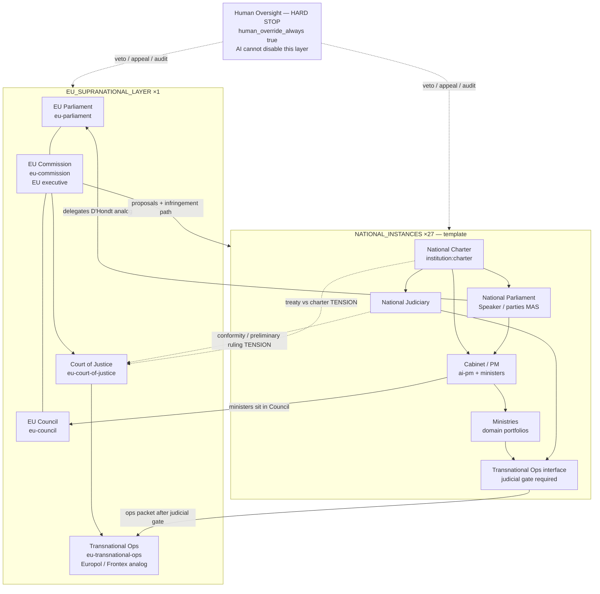
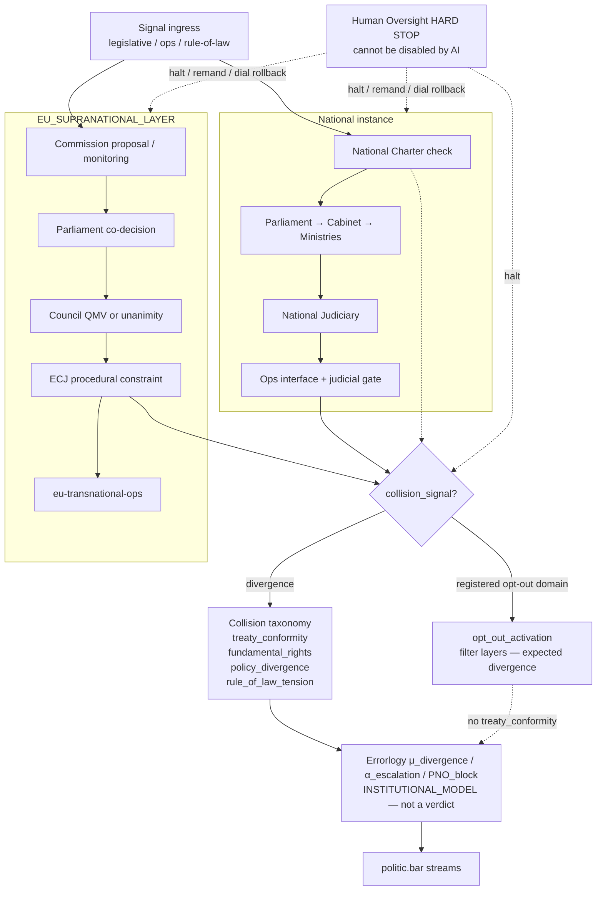
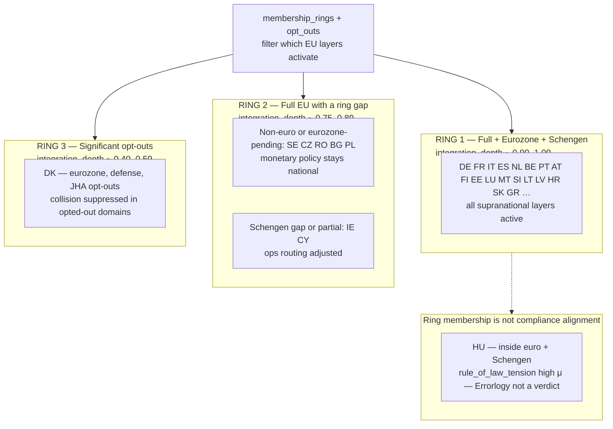

# EU AI-State Schema (visual)

**Epistemic label:** `INSTITUTIONAL_MODEL` — diagrams model the European Union as a two-tier topology inside the AI-Native Government simulator. They are not a claim of legal authority, sovereign standing, or real-world governance capacity.

This page is the **look-at-it** schema. Narrative, collision taxonomy, and dials live in [EU_TOPOLOGY.md](EU_TOPOLOGY.md). Member-state parameters live in [EU_STATES.md](EU_STATES.md). Stable IDs: `schemas/institution-layer-id.json`. National instance fields: `schemas/state-profile.json`.

---

## Diagram 1 — Two-tier structure and role mapping

National parliaments send **delegates** into EU Parliament. National ministers sit in EU Council. The Commission is the **EU-level executive**. ECJ and national judiciary are **co-present constraint layers** (tension, not a verdict). Transnational Ops always uses the national judicial-gate interface. Human Oversight is a hard stop on both tiers.

---

## Diagram 2 — Collision and event flow (μ/α, not verdicts)

When a national charter or national output diverges from an EU-layer requirement, the simulator emits a `collision_signal`. Opt-outs **filter** activation (no `treaty_conformity` collision). Unresolved tension routes to Errorlogy as fuzzy membership — **not** guilt or legitimacy verdicts. Human Oversight can halt the cascade at any step.

---

## Diagram 3 — Variable geometry (integration rings)

The EU is not a uniform bloc. Before collision resolution, each national instance filters activated EU layers by `membership_rings` and `opt_outs` (`state-profile.json`). Rings are **modeling clusters**, not ranks of legitimacy.

---

## How to read the schema

| Element | Meaning in the simulator |
|---------|--------------------------|
| Two tiers | 27 full national stacks + one EU coordination layer. EU does not replace national instances. |
| Delegate / minister arrows | Aggregation into EP and Council — not a transfer of sovereignty. |
| Commission | EU-level executive analog (`institution:eu-commission`). |
| Dashed judiciary / charter arrows | Modeled **tension**. Feeds Errorlogy μ/α. Not a court verdict. |
| Judicial gate | `judicial_gate_bypass: false` — invariant on transnational ops. |
| Human Oversight | Structural hard stop; AI agents cannot remove or route around it. |
| Rings | Variable geometry. Opt-outs filter layer activation. |

---

## Related documents

- [EU_TOPOLOGY.md](EU_TOPOLOGY.md) — role definitions, collision taxonomy, autonomy dials
- [EU_STATES.md](EU_STATES.md) — all 27 member-state profiles
- [AI_GOVERNMENT_OVERVIEW.md](AI_GOVERNMENT_OVERVIEW.md) — base national stack
- [AI_PARLIAMENT.md](AI_PARLIAMENT.md) — Speaker / parties / ministers / PM
- [CHARTER.md](CHARTER.md) — charter constraints and human override hook
- [OVERVIEW.md](OVERVIEW.md) — short institutional map
- [ARCHITECTURE.md](../../ARCHITECTURE.md) — umbrella data flow

---

*Phase classification: Phase 3 (institutional depth — visual schema). See ROADMAP.md.*
