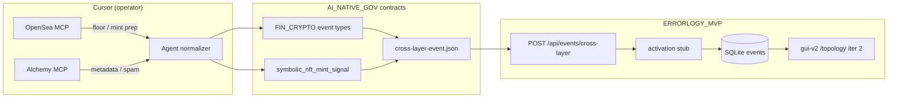

# Connection Guide — OpenSea, Alchemy, MatrAIx → AI Native Gov

Practical setup for a **Cursor agent** at `C:\Users\Public\AI_NATIVE_GOV` to connect NFT/market MCP tools and optional persona cohorts into the institutional simulator — without storing secrets in git.

**Epistemic label:** `INSTITUTIONAL_MODEL` (this doc). Adapter envelopes default to `OPERATIONAL`. Mint and execution surfaces stay **human-approved** and **rights-gated**.

**Sibling contracts:** [FIN_CRYPTO_MARKETS.md](FIN_CRYPTO_MARKETS.md) · [SYMBOLIC_VISUAL_LAYER.md](SYMBOLIC_VISUAL_LAYER.md) · [SYMBOLIC_INGEST.md](SYMBOLIC_INGEST.md) · [MATRAIX_PERSONA.md](MATRAIX_PERSONA.md) · [MVP_ITERATIONS.md](../examples/MVP_ITERATIONS.md)

---

## Scope

| Integration | Default mode | Runtime home |
|-------------|--------------|--------------|
| **OpenSea MCP** | Market read + mint **prep** (tx for wallet sign) | Cursor MCP → normalize → `ERRORLOGY_MVP` |
| **Alchemy MCP** | Read-only NFT/on-chain metadata | Cursor MCP → market-data ingress only |
| **MatrAIx Persona** | Optional cohort tags (post-MVP adapter) | Child repo + sidecar metadata |
| **thirdweb / Rare / Solana mint MCPs** | **Off by default** (Phase 5, approval-gated) | Not in MVP path |

This guide covers **agent-side MCP wiring in Cursor** and **POST to the live cross-layer stub** in `ERRORLOGY_MVP/errorlogy-mas`. FastAPI does **not** host MCP subprocesses — the agent normalizes MCP tool output and POSTs envelopes.

---

## Cursor MCP config (Windows)

Cursor reads MCP servers from **one of**:

| Scope | Path (Windows) |
|-------|----------------|
| **Global** | `%USERPROFILE%\.cursor\mcp.json` (e.g. `C:\Users\<you>\.cursor\mcp.json`) |
| **Project** | `.cursor\mcp.json` in repo root (`C:\Users\Public\AI_NATIVE_GOV\.cursor\mcp.json`) |

**Rules**

- Put API keys and OAuth tokens **only** in local MCP config or OS env — **never** in umbrella git, `.env` committed to repo, or this doc.
- Prefer **project-level** `.cursor\mcp.json` for team-shared *structure* with placeholder values; each operator fills secrets locally.
- After editing: **Cursor Settings → MCP** → verify green status; restart Cursor if tools do not appear.
- Add `.cursor/mcp.json` to `.gitignore` if it will contain real keys (pattern only in docs is OK to commit).

**Placeholder pattern (no secrets):**

```json
{
  "mcpServers": {
    "OpenSea": {
      "url": "https://mcp.opensea.io/mcp",
      "headers": {
        "X-API-KEY": "<OPENSEA_API_KEY — local only>"
      }
    },
    "alchemy": {
      "type": "streamable-http",
      "url": "https://mcp.alchemy.com/mcp"
    }
  }
}
```

Alchemy uses **OAuth** (sign in with Alchemy account when prompted). OpenSea uses **API key in header** for data tools; **wallet OAuth** is separate for mint/eligibility tools (see below).

---

## A) OpenSea MCP in Cursor

**Official docs:** [OpenSea MCP reference](https://docs.opensea.io/reference/mcp) · endpoint `https://mcp.opensea.io/mcp` · [Build with AI agents](https://docs.opensea.io/docs/build-with-ai-agents)

### 1. Get an API key (local only)

| Method | Use |
|--------|-----|
| Instant key (7-day free tier) | `curl -X POST https://api.opensea.io/api/v2/auth/keys` — or MCP tool `get_instant_api_key` after URL-only connect |
| Full key | [opensea.io](https://opensea.io) → **Settings → Developer** |

Same key works for REST and MCP. Store in MCP `headers.X-API-KEY` or env `OPENSEA_API_KEY` referenced from config — not in repo.

### 2. Add to Cursor

**Settings → MCP → Add new global MCP server**, or edit `.cursor\mcp.json`:

```json
{
  "mcpServers": {
    "OpenSea": {
      "url": "https://mcp.opensea.io/mcp",
      "headers": {
        "X-API-KEY": "<local — see step 1>"
      }
    }
  }
}
```

Handshake and `tools/list` work without a key; data tools require the header.

### 3. OAuth for wallet (mint prep only)

Mint and drop tools need **two credentials**:

| Credential | Header | Purpose |
|------------|--------|---------|
| OpenSea API key | `X-API-KEY` | Data + drop lookup |
| Wallet JWT (OAuth / SIWE) | `Authorization: Bearer <wallet_jwt>` | Eligibility, `get_mint_action`, `deploy_seadrop_contract` |

In Cursor: after OpenSea MCP is discovered, complete **OAuth / wallet sign-in** when prompted. The agent receives **unsigned transaction data** — the **human wallet signs** in wallet UI. **Never** put a hot private key or seed phrase in MCP config or agent prompts.

### 4. What the agent can do (by risk tier)

| Tier | Example MCP tools | Simulator policy |
|------|-------------------|------------------|
| **Market-data (default)** | Collection stats, floor, volume, trending, wallet NFT holdings (public address) | Enable → map to `fin_crypto_market_snapshot` |
| **Mint prep (approval-gated)** | `get_drop_details`, `check_drop_eligibility`, `get_mint_action`, `deploy_seadrop_contract` | Human must approve; catalog asset must have `rights_status` cleared; emit `symbolic_nft_mint_signal` — agent does **not** auto-submit tx |
| **Trading / swap / write** | Swaps, cancel orders, profile write | **Refuse** in institutional simulator path (same as FIN_CRYPTO execution surface) |

### 5. Normalize → cross-layer POST

After an MCP call, map to umbrella event types and POST to Errorlogy stub:

**Endpoint (live in `ERRORLOGY_MVP`):**

```http
POST http://localhost:8000/api/events/cross-layer
Content-Type: application/json
```

**Market floor / stats → `fin_crypto_market_snapshot`:**

```json
{
  "story_id": "2026-aing-opensea-floor-check",
  "event_type": "fin_crypto_market_snapshot",
  "stream_refs": ["opensea:collection:<slug>", "symbolic:collection:<catalog_id>"],
  "jurisdiction_set": ["global"],
  "epistemic_label": "OPERATIONAL"
}
```

Stub fills `activated_layers` for `fin_crypto_*` prefix (central-bank-analog, regulatory-agency, eu-commission, executive) — see `mas/institutional/activation.py`.

**Mint prep (post human approval + rights) → `symbolic_nft_mint_signal`:**

```json
{
  "story_id": "2026-aing-mint-prep-approved",
  "event_type": "symbolic_nft_mint_signal",
  "stream_refs": [
    "symbolic:variant:<variant_id>",
    "opensea:drop:<slug>",
    "mint_action:prepared_not_submitted"
  ],
  "activated_layers": ["institution:symbolic-visual", "institution:audit"],
  "epistemic_label": "OPERATIONAL"
}
```

**Approval gate (non-negotiable):**

1. Catalog row exists in [SYMBOLIC_VISUAL_LAYER](SYMBOLIC_VISUAL_LAYER.md) with `rights_status` ∈ `{cleared_nft, cleared_merch}` for third-party art — never from scrape alone ([SYMBOLIC_INGEST](SYMBOLIC_INGEST.md)).
2. Human explicitly approves mint prep in chat or UI.
3. Agent may call `get_mint_action` and return tx payload for **wallet sign only** — not broadcast.
4. If rights unclear → emit `symbolic_rights_blocked` instead.

List stored events: `GET http://localhost:8000/api/events/cross-layer?limit=20`

---

## B) Alchemy MCP (read-only ingress)

**Official docs:** [Alchemy MCP Server](https://www.alchemy.com/docs/alchemy-mcp-server) · endpoint `https://mcp.alchemy.com/mcp`

### Setup in Cursor

Add to the same `.cursor\mcp.json`:

```json
{
  "mcpServers": {
    "alchemy": {
      "type": "streamable-http",
      "url": "https://mcp.alchemy.com/mcp"
    }
  }
}
```

Restart Cursor → first tool use opens **OAuth** (Alchemy account). No API key in config required for hosted MCP.

### Read-only use in this project

| Use | Map to |
|-----|--------|
| NFT metadata, owners, contract info | `fin_crypto_market_snapshot` or enrich `stream_refs` on symbolic events |
| Spam / contract reputation signals | `fin_crypto_onchain_risk` (hypothesis context — not accusations) |
| Token prices (if used) | `fin_crypto_market_snapshot` |

**Do not** enable Alchemy tools that simulate writes, deploy contracts, or submit transactions in the institutional simulator path. Treat Alchemy as **market-data / metadata ingress** only.

Example envelope after metadata fetch:

```json
{
  "story_id": "2026-aing-alchemy-metadata",
  "event_type": "fin_crypto_onchain_risk",
  "stream_refs": ["alchemy:contract:0x…", "symbolic:collection:<id>"],
  "epistemic_label": "OPERATIONAL"
}
```

---

## C) Full mint paths (thirdweb / Rare / Solana) — NOT default

Community/vendor MCPs that **deploy or write on-chain** (e.g. thirdweb remote MCP `deployContract` / `writeContract`, Rare Protocol `rare mcp serve --allow-writes`, Solana Agent Kit `MINT_NFT`) are **Phase 5 / approval-gated only**.

| Rule | Detail |
|------|--------|
| Phase | [ROADMAP.md](../../ROADMAP.md) Phase 5 agent playbooks — not Iterations 1–3 |
| Secrets | Server wallets, deployer keys, Rare write flags → **env on operator machine only** |
| Policy | Same as FIN_CRYPTO execution surface: refuse in simulator unless explicit human approval + sandbox/testnet-first + audit journal |
| Catalog | Still requires symbolic `rights_status` clearance before any mint signal |

Do not wire these into the default Cursor MCP bundle for AI Native Gov MVP.

---

## D) MatrAIx Persona (optional, may be in progress)

Full contract: **[MATRAIX_PERSONA.md](MATRAIX_PERSONA.md)** (exists — do not claim 8.3B simultaneous agents).

### Sources

| Asset | URL |
|-------|-----|
| Persona 1M coreset (HF) | [MatrAIx_Persona_1M](https://huggingface.co/datasets/MatrAIx2026/MatrAIx_Persona_1M) |
| Playground + tasks | [MatrAIx-ai/MatrAIx-Persona-8B](https://github.com/MatrAIx-ai/MatrAIx-Persona-8B) |
| Report | [arXiv:2608.04205](https://arxiv.org/abs/2608.04205) |

### Connection pattern (when adapter ships)

1. Sample a **declared cohort** from Persona 1M (filter recipe + seed) in `ERRORLOGY_MVP` child adapter — not in umbrella repo.
2. Attach `persona_cohort_id` via **sidecar** next to stored cross-layer row until [schemas/persona-cohort-ref.json](../../schemas/persona-cohort-ref.json) is `$ref`'d into `cross-layer-event.json` (Phase B in MATRAIX doc).
3. Optional extension on `state-profile` for `default_persona_filter` per national instance — still `INSTITUTIONAL_MODEL`.
4. Run Errorlogy μ/α/PNO on **persona-conditioned decision events** — see [ERRORLOGY.md](ERRORLOGY.md).

**Do not block** OpenSea/Alchemy MVP on MatrAIx download or Playground setup.

---

## E) End-to-end flow



**Data path summary:**

```text
Cursor MCP tool call
  → adapter normalizes (FIN_CRYPTO record shape or symbolic event_type)
  → cross-layer envelope (story_id, event_type, stream_refs, epistemic_label=OPERATIONAL)
  → POST /api/events/cross-layer  (errorlogy-mas :8000)
  → frame_cross_layer_event() fills activated_layers if omitted
  → gui-v2 Iteration 2: GET /api/events/cross-layer → topology highlight
```

**Runtime prerequisites:**

```powershell
cd C:\Users\Public\ERRORLOGY_MVP\errorlogy-mas
# start API (uvicorn) on :8000 — see child repo README
```

Cross-layer stub response includes `"note": "INSTITUTIONAL_MODEL framing stub — no analyze/μ run"`. μ/α/PNO remains in Errorlogy analyze path when wired later.

---

## F) Minimal first session checklist (5 steps)

1. **MCP config** — Create `C:\Users\Public\AI_NATIVE_GOV\.cursor\mcp.json` with OpenSea URL + local `X-API-KEY`; add Alchemy streamable-http URL. Verify green in Cursor Settings → MCP.
2. **Start Errorlogy API** — Run `errorlogy-mas` on `localhost:8000`; smoke `GET /api/events/cross-layer`.
3. **Market read** — In Cursor agent chat: ask OpenSea MCP for a collection floor/stats; agent POSTs `fin_crypto_market_snapshot` with `stream_refs` linking catalog slug if known.
4. **Metadata cross-check** — Ask Alchemy MCP for same contract metadata/owners; POST enrich or `fin_crypto_onchain_risk` if spam flags — read-only only.
5. **Mint prep (optional, gated)** — Only if symbolic asset has cleared `rights_status` and you explicitly approve: OpenSea `get_mint_action` → wallet signs → agent emits `symbolic_nft_mint_signal` with `mint_action:prepared_not_submitted` — never auto-broadcast.

---

## Guardrails (shared)

| Do | Don't |
|----|-------|
| Label outputs `OPERATIONAL` / `INSTITUTIONAL_MODEL` | Present market or mint prep as legitimacy verdict |
| Keep keys in local MCP config / env | Commit `.env`, mcp.json with secrets, or private keys |
| Require human approval for mint tx prep | Auto-submit SeaDrop or deploy txs from agent |
| Check `rights_status` before mint signals | Auto-mint scraped IG/Pinterest art |
| POST envelopes to cross-layer stub | Duplicate μ/α engine math in umbrella |

---

## Links

- OpenSea MCP: https://docs.opensea.io/reference/mcp
- Alchemy MCP: https://www.alchemy.com/docs/alchemy-mcp-server
- MatrAIx: [MATRAIX_PERSONA.md](MATRAIX_PERSONA.md)
- Fin-crypto contract: [FIN_CRYPTO_MARKETS.md](FIN_CRYPTO_MARKETS.md)
- Symbolic catalog: [SYMBOLIC_VISUAL_LAYER.md](SYMBOLIC_VISUAL_LAYER.md)
- MVP iterations: [MVP_ITERATIONS.md](../examples/MVP_ITERATIONS.md)
- Cross-layer schema: [`schemas/cross-layer-event.json`](../../schemas/cross-layer-event.json)
- Errorlogy stub: `ERRORLOGY_MVP/errorlogy-mas/api/routers/cross_layer.py`

*Phase classification: Phase 1–2 connection playbook; Phase 5 for full mint MCPs and MatrAIx runtime adapter.*
